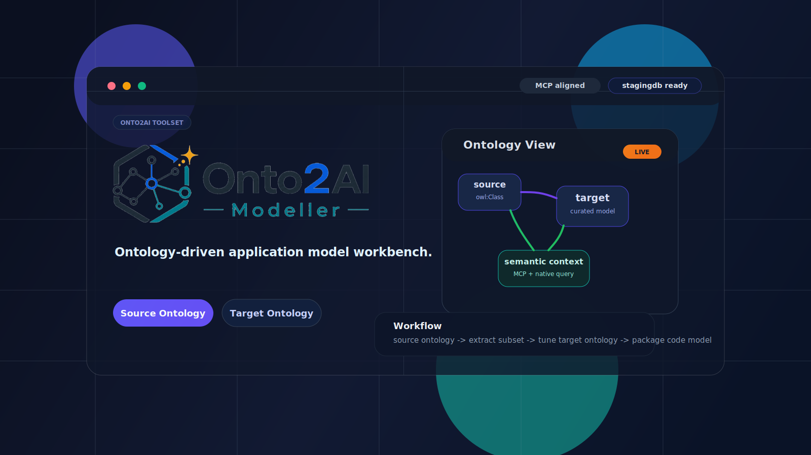

# Onto2AI Toolset



Onto2AI Toolset is a generic toolkit for loading, exploring, extracting, shaping, and packaging ontologies with Neo4j and AI-assisted workflows.

This repository is the toolset itself. Field-specific ontologies and models such as entitlement or parcel are examples of outputs that can be produced with the toolset, not the core product definition.

## Value Proposition
Onto2AI Toolset helps ontology engineers, data modelers, and AI engineers:
- load well-known ontologies into a Neo4j ontology database for inspection and reuse
- explore concepts, relationships, restrictions, rules, and axioms through graph and MCP tooling
- extract a focused subset of concepts from large ontologies such as FIBO and other standards
- use those subsets as building blocks for domain-specific or application-specific ontologies
- generate implementation artifacts such as Neo4j constraints, query context, and Pydantic models
- keep ontology, schema, API, and runtime data aligned to a single semantic foundation

## Scope
This repository is scoped to ontology-centric workflows:
- ontology load and materialization
- ontology exploration and subset extraction
- MCP schema tooling and AI-assisted enhancement
- staging database enrichment and consolidation
- packaging finalized ontology deliverables
- Onto2AI Modeller web UI for review and operations

## Typical Uses
This toolset is especially useful when you want to:
- inspect a large public ontology and understand its reusable conceptual structure
- extract a domain-relevant subset of concepts, properties, restrictions, and axioms
- build your own ontology on top of a trusted well-known ontology instead of starting from scratch
- generate implementation-ready schema artifacts from ontology-driven design
- let an AI engineer use Neo4j and MCP tools as an ontology workbench rather than treating an ontology as static RDF files

## Onto2AI Modeller
Onto2AI Modeller is an AI-assisted model-enrichment UI and a core part of Onto2AI Toolset. It helps users review ontology-derived models, refine subsets, and shape implementation-ready schemas without losing semantic grounding.

In the staging area, users can review and evolve models in ontology, UML, or object-oriented (class model) formats. You can inspect and refine classes, relationships, properties, and hierarchies, and use AI assistance to add or modify model elements.

Before publishing, users can generate sample data, run end-to-end application data flow tests, and validate model quality so the resulting model is ready for downstream distribution and implementation.

## Primary Workflow
1. Configure environment variables (Neo4j + model/API keys).
2. Load a well-known ontology or your own ontology data into Neo4j.
3. Explore concepts, rules, and axioms through MCP and graph queries.
4. Extract or refine a subset of the ontology for your target use case.
5. Stage and consolidate the resulting schema for implementation.
6. Finalize schema design and review in Modeller UI.
7. Validate the implementation workflow with smoke tests and schema checks when applicable.
8. Publish the resulting ontology package and implementation artifacts.

Example outcome:
- use the toolset to derive a field-specific package such as an entitlement ontology package or a parcel ontology package
- validate that package with domain-specific constraints, query context, and smoke tests
- distribute that package separately from the generic toolset

## Quickstart
See: [docs/quickstart.md](./docs/quickstart.md)

## Operator Runbook
See: [docs/operator-runbook.md](./docs/operator-runbook.md)

## Core Commands

### Install
```bash
pip install .
```

### Client CLI
```bash
onto2ai-client
# or
python -m neo4j_onto2ai_toolset.onto2ai_client
```

### MCP Server
```bash
onto2ai-mcp
# HTTP mode
onto2ai-mcp http 8082
```

### Loader
```bash
python -m neo4j_onto2ai_toolset.onto2ai_loader
```

The loader is not limited to one ontology family. You can use it to bring well-known ontologies into Neo4j, inspect them, and prepare them for subset extraction and downstream ontology design.

### Packaging
```bash
# build source + wheel artifacts
python -m build

# artifacts output
ls -la dist/

# optional: install built wheel locally
python -m pip install --force-reinstall --no-deps dist/onto2ai_engineer-0.9.0-py3-none-any.whl
```

### Example Outputs
Using the toolset, you can produce field-specific deliverables such as:
- a customized ontology RDF
- a generated Neo4j constraint script
- a generated Neo4j query context
- a generated Pydantic model
- a domain-specific smoke test

Examples created with this toolset have included entitlement-oriented and parcel-oriented ontology packages. Those are domain outputs built by using the toolset, not the generic definition of the toolset itself.

### Ontology Validation
```bash
python scripts/validate_ontology.py resource/ontology/www_onto2ai-toolset_com/ontology
```

### Modeller
```bash
onto2ai-modeller --model gemini --host localhost --port 8180
# or
python -m onto2ai_modeller.main --model gemini --host localhost --port 8180
```

### Demo Workflow
See: [demo/README4DEMO](./demo/README4DEMO)

## Reference Docs
- Loader: [README4LOADER.md](./README4LOADER.md)
- MCP: [README4ONTO2AI_MCP.md](./README4ONTO2AI_MCP.md)
- Config Contract: [docs/configuration.md](./docs/configuration.md)
- Interface Contract: [docs/interface-contract.md](./docs/interface-contract.md)
- Milestone Plan: [docs/milestones/onto2ai-engineer-only.md](./docs/milestones/onto2ai-engineer-only.md)
- Release Notes: [docs/release-notes-v0.4.0.md](./docs/release-notes-v0.4.0.md)
- Demo Guide: [demo/README4DEMO](./demo/README4DEMO)

## Notes
- Root `main.py` is a compatibility shim and is deprecated.
- Canonical execution is package-first (`onto2ai-client`, `onto2ai-mcp`, `python -m ...`).
- Root `staging/` should be treated as a transient local workspace; finalized domain outputs should be packaged separately from the generic toolset.
