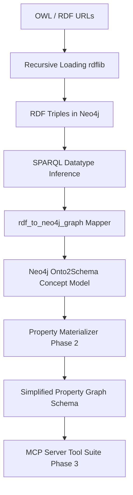

## Ontology Loader (RDFLib → Neo4j → Onto2AI Schema)

This document describes the ontology loading pipeline implemented in  
`neo4j_onto2ai_toolset/onto2schema/onto2ai_loader.py`.

The loader ingests OWL/RDF ontologies (including all `owl:imports`) into Neo4j using **RDFLib + rdflib-neo4j**, enriches the RDF graph with inferred datatype-property ranges, and then converts the RDF layer into the project’s **Neo4j Onto2Schema domain model**.

---

## High-level workflow



---

## Loading Phase

1. **Recursive Load**: Follows `owl:imports` to pull all dependencies.
2. **Stream into Neo4j**: Uses `rdflib-neo4j` for persistency.
3. **Inference**: Infers ranges for datatype properties that lack them.
4. **Graph Mapping**: Converts RDF class/restriction nodes into a navigable Neo4j model.

---

## Materialization Phase (Post-Load)

Once the ontology is loaded, use the `property_materializer.py` to simplify complex OWL restrictions into direct relationships:

```bash
export PYTHONPATH=$PYTHONPATH:.
python3 neo4j_onto2ai_toolset/onto2schema/property_materializer.py
```

**What it does:**
- Flattens `owl:Restriction` chains into direct relationships.
- Resolves cardinality (e.g., `1`, `0..*`) from OWL constraints.
- Handles `FunctionalProperty` constraints.
- Cleans up duplicate relationships by URI.

---

## Schema Interfacing Phase (MCP Server)

The final layer provides AI-ready schema management tools via the MCP server:

```bash
python3 neo4j_onto2ai_toolset/onto2ai_mcp.py
```

### Key Capabilities:
- **`get_materialized_schema`**: Access direct and inherited properties for any class.
- **`extract_data_model`**: Get structured JSON representation of nodes and relationships.
- **`generate_schema_code`**: Produce SQL DDL, Pydantic classes, or Neo4j constraints.

---

## Prerequisites

- Python 3.10+
- Neo4j 5.x (local or Aura)
- Python packages:
  - rdflib
  - rdflib-neo4j
  - neo4j
  - neo4j-onto2ai-toolset

Install dependencies:

```bash
pip install -r requirements.txt
```

Install a local build of `rdflib-neo4j` if needed:

```bash
pip install /path/to/rdflib-neo4j/dist/rdflib-neo4j-1.0.tar.gz
```

---

## Configuration

### Neo4j model database

Configured via:
- `onto2ai_tool_config.py`
- `get_neo4j_model_config()`

Typical parameters:
- `NEO4J_MODEL_URL`
- `NEO4J_MODEL_USERNAME`
- `NEO4J_MODEL_PASSWORD`
- `NEO4J_MODEL_DB_NAME`

### RDF store configuration

The loader initializes an RDF store using:

```python
Neo4jStoreConfig(
    auth_data=auth_data,
    custom_prefixes=prefixes,
    handle_vocab_uri_strategy=HANDLE_VOCAB_URI_STRATEGY.SHORTEN,
    batching=True
)
```

⚠️ When `batching=True`, the store **must be explicitly closed** to flush writes.

---

## Running the loader

From the project root:

```bash
python neo4j_onto2ai_toolset/onto2schema/onto2ai_loader.py
```

### Select ontology to load

Edit in `onto2ai_loader.py`:

```python
file_path = "<ONTOLOGY_URI>"
format = "application/rdf+xml"
```

Supported formats include:
- `application/rdf+xml`
- `ttl`
- `nt`

---

## Logging and output

During execution, the loader logs:

- Neo4j configuration and connection details
- Each loaded ontology URI
- Inferred datatype-property triples
- Final triple count summary

Example:

```
Loading: https://spec.edmcouncil.org/fibo/ontology/...
subj: <ClassURI>, pred: <DatatypePropertyURI>, Type: xsd:string